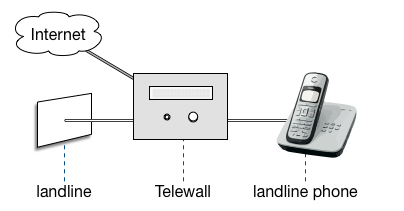

# Telewall
This is a hardware and software project to defend against unwanted calls on landline.

## Status
This is currently a **proof of concept**, some functions don't function corrently. You should consider it **beta software**. With your help it can be stabalized and improved.

Tasks to be done:

 - translate to local languages (the audio and web are currently only german)
 - add more blacklist sources
 - increase test coverage
 - implement authorization in the web app
 - protect web app against Cross-Site Request Forgery (CSRF)
 - make everything more stabalized

## Overview
Many people are regularly disturbed by unwanted calls on the landline. There are blocking apps for smart phones, but the landline phones stay unprotected. This solution allows to use blacklist from consumer organizations and is easy to use and manage even for older people.

The *Telewall* (Telephone Firewall) is like a firewall that you install between your telephone and the public telephone network. The solution consists of a python program that interacts with Asterisk and an analog telephone adapter (ATA). LED and a display show the status of the calls and the caller id and name. Callers can be blocked with the push of a button. A message is played back to the caller, stating the cause of the blocking.





The blacklist is currently imported from [K-Tipp](https://www.ktipp.ch/service/warnlisten/detail/w/unerwuenschte-oder-laestige-telefonanrufe), a swiss customer organization.

The blacklist can be managed in different ways. There is a special number you can call from your landline phone, e.g. *46*0344264141#, to block a phone number. Moreover, there is a web application that allows to list incoming calls and the blacklist from a computer, tablet or smartphone.



## Components
This solution consists of hardware and software parts. Some hardware is optional. For example if you are using a SIP provider and a SIP phone you don't need the Cisco Phone Adapter.

### Hardware


 - Raspberry Pi 2 (incl. SD card, USB-Adapter) for computation ($ 45)
 - Cisco SPA232D as a telephone adapter for the landline and the phone. ($ 75)
 - RGB LED for status  ($ 2.05, http://adafru.it/159)
 - 16x2 Character LCD  ($ 2.00, http://www.ebay.com/itm/171421296133 )
 - 16mm Illuminated Pushbutton ($ 1.50, http://adafru.it/1477)
 - 3x 1kΩ resistor for led, button and display (ebay)
 - 2x 220Ω resistor for led and button (ebay)
 - 40x Jumper wires F/F ($ 3.95, http://adafru.it/794)

Total cost is arround $ 170, but can be reduced by removing the Cisco ATA and reusing existing cables.


### Software
The solution consists of the following software parts. The source code and the configurations are provided in this repository.



- ATA (Cisco SPA232D) connects to the landline and the phone. it also provides two ethernet ports that can be used. The ATA can be configured with the file `SPA232D_1.4.0.cfg`.
- Raspberry Pi provides a linux system where the telewall application, the databases, apache2 and asterisk are running.
- The telewall application is built using python scripts and is installed on `/telewall`.  
- The SQLite3 database files are installed in `/telewall/data` und `/var/log/asterisk/master.db`.
- Apache2 starts the Python-Scripts for Telewall-Web and uses the configuration files in `/etc/ apache2`.
- Asterisk uses the configuration files in `/etc/asterisk`.


# Installation
See the wiki: https://github.com/synox/telewall/wiki

# Usage
See the wiki: https://github.com/synox/telewall/wiki/User-Manual
